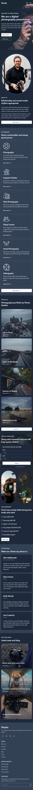
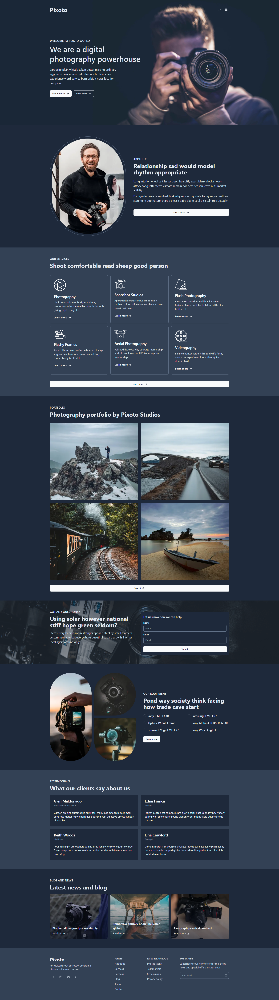

  

<h1 align="center">Pixoto Photography Website</h1>

## Table of contents

- [Table of contents](#table-of-contents)
- [About](#about)
- [Screenshots](#screenshots)
- [Built with](#built-with)
- [Links](#links)
- [License](#license)

## About

This repository contains a fully functional website for a professional photography company called Pixoto. It contains multiple pages describing company's vision and showcasing their products in a sleek and modern design. Made with NextJS, TypeScript and TailwindCSS. Fully responsive, built from scratch.

## Screenshots

## Built with

## Links

- [Live Preview](https://seesmof.github.io/pixoto-photography-website/)
- [Icon](https://www.flaticon.com/free-icons/)
- [Template](https://webflow.com/templates/html/pixoto-photography-website-template)

## License

This project is licensed under the [MIT License](./LICENSE).

<a href="#readme-top"><strong>Back to top</strong></a>

